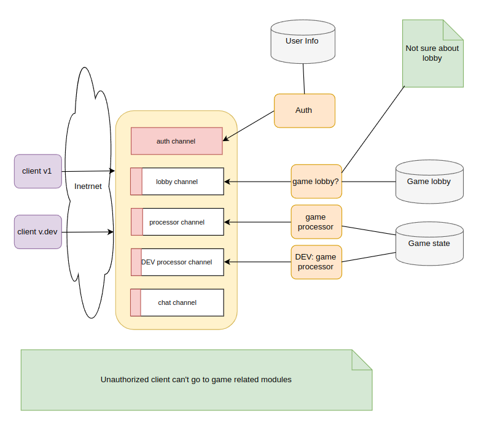

# gateway-load-example

Gateway is some kind of proxy between servers and clients. Let's name servers as channel masters.
So, main idea is to put gateway somewhere at hosting or even at home with white IP address, and then this gateway can be used with clients and servers.
It allows easy way to test server, and one more server(even from another location) and update server.

THe main thing about gateway - i am using kotlin to produce applications. For me it is an entertaiment and studying. 
Can't publish gateway for now, coz it is as early developing stage, but it is workable.
There are couple features which are required for production, thins i am keeping in mind: 
- channel master authorization configuration
- encryption(optional)
- embedded reconnect for clients and channel masters
- round robin mode for channel masters
- some support for versions. So inside channel could be different version, can be useful for migration to new server. But also can be done by naming new channel for new version

